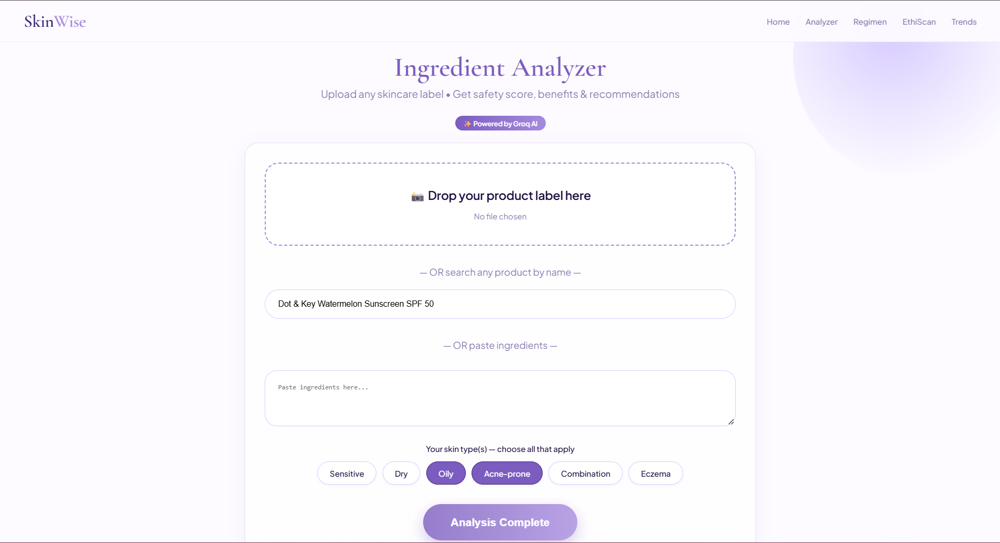
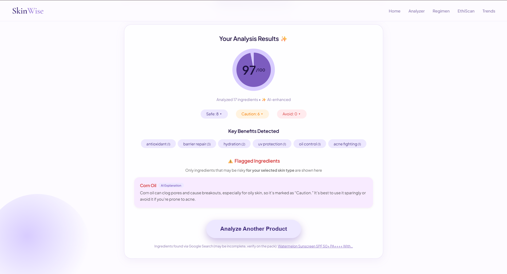
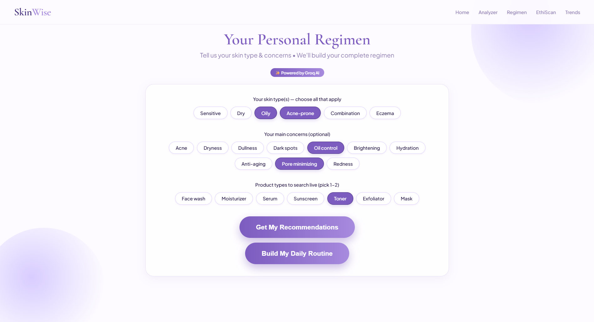
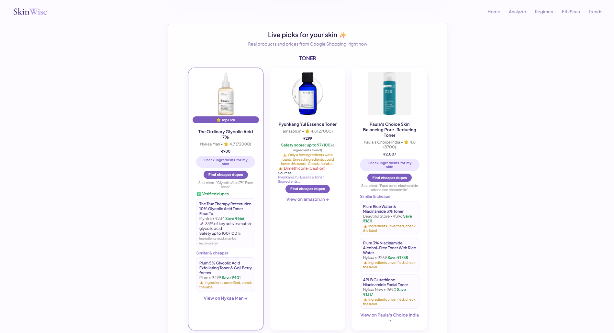
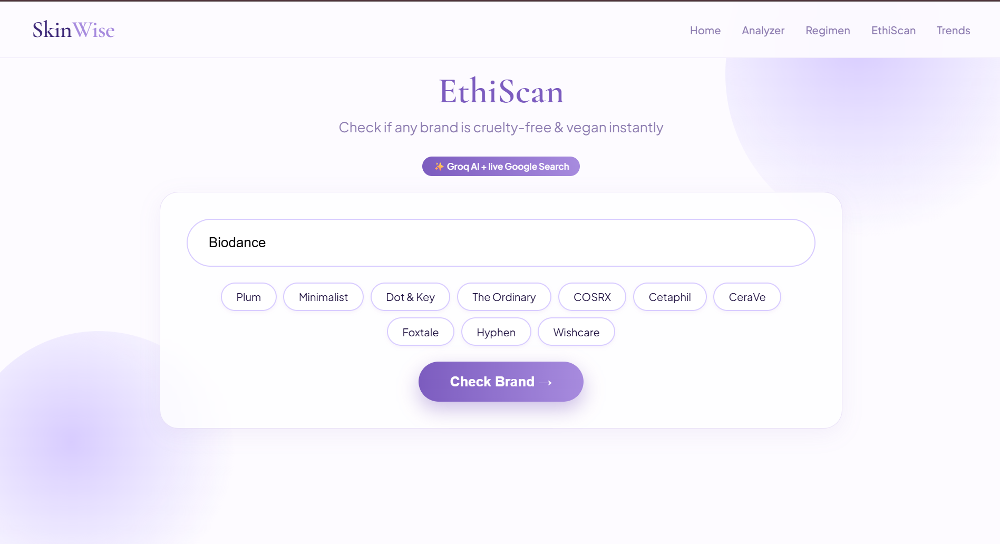
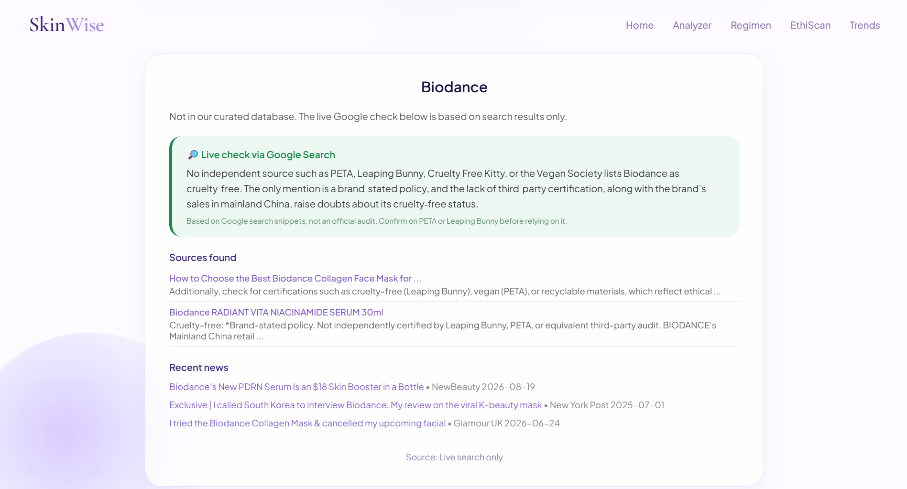
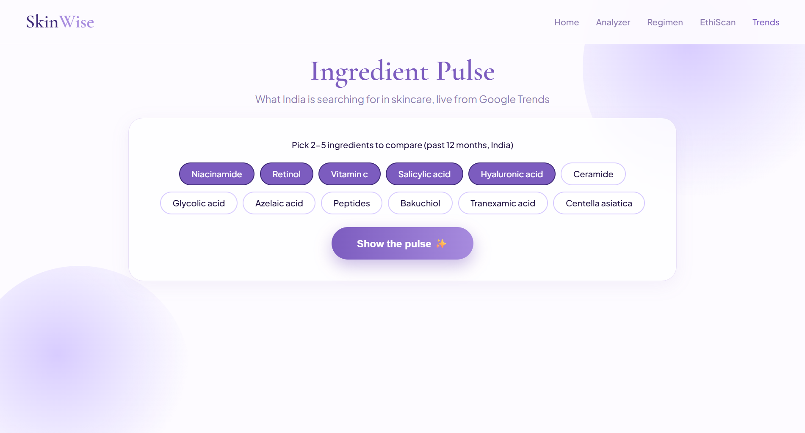
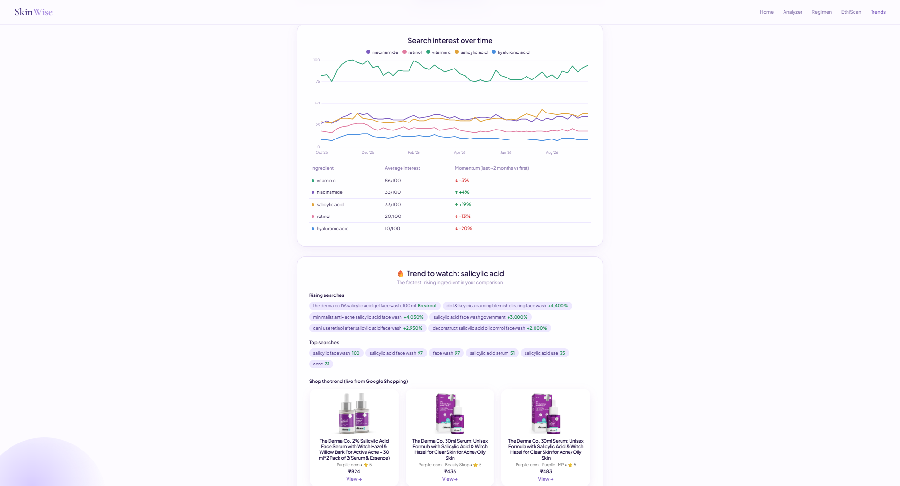
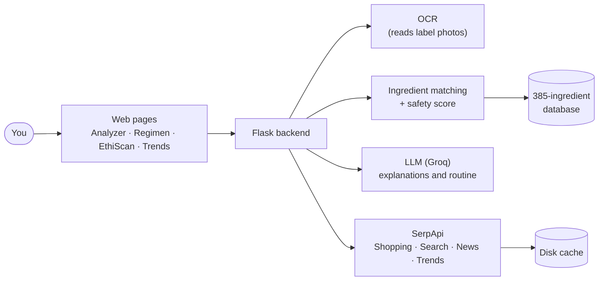
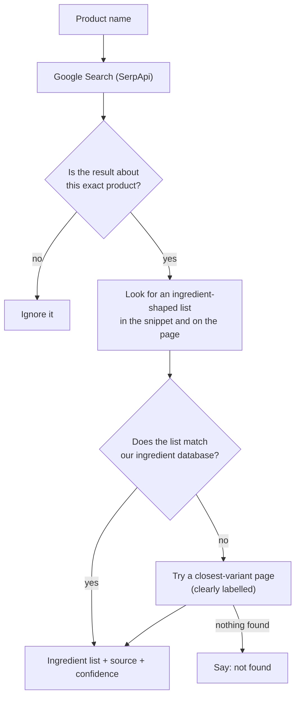

<div align="center">

# SkinWise 🧴

### Type any skincare product. Get its ingredients, a safety score for your skin, cheaper look-alikes, and an honest check on the brand — all from live web data.


[▶ **Watch the 3-minute demo**](YOUR_VIDEO_LINK)  ·  [Getting started](#getting-started)  ·  [How well does it work?](#how-well-does-it-work)

</div>

---

## Demo

| | What you do | What you get |
|---|---|---|
| **🔬 Ingredient Analyzer** |  |  |
| **✨ Cheaper dupes** |  |  |
| **🐰 EthiScan** |  |  |
| **📈 Ingredient Pulse** |  |  |
---

## In plain English

Skincare shopping is hard. Products are sold on claims like "for oily skin" or "dermatologist tested", but the things that actually matter are buried: **what is inside it**, **whether another product does the same job for less**, and **whether the brand is really cruelty-free**.

SkinWise does that homework for you. Type a product name (or photograph its label) and it:

1. **finds the ingredient list** on the web,
2. **checks every ingredient** against a database of 385 skincare ingredients and gives a **0–100 safety score for your skin type**,
3. **finds cheaper look-alikes** that share the same key ingredients,
4. **checks the brand** for cruelty-free and vegan evidence, with sources and recent news.

When it isn't sure, it says so, instead of guessing.

> **Example:** you like a ₹900 glycolic acid toner. SkinWise reads its ingredients, scores them for your skin, and shows a ₹499 toner with the same active, labelled *"similar and cheaper, ingredients unverified, check the label"* when it couldn't read the other product's full list.

> ⚠️ SkinWise is a screening aid, **not medical advice**.

---

## Table of contents
- [What you can do](#what-you-can-do)
- [What this project demonstrates](#what-this-project-demonstrates)
- [How it works](#how-it-works)
- [Honest by design](#honest-by-design)
- [How well does it work?](#how-well-does-it-work)
- [Where the live data comes from](#where-the-live-data-comes-from)
- [Tech stack](#tech-stack)
- [Getting started](#getting-started)
- [Troubleshooting](#troubleshooting)
- [Project structure](#project-structure)
- [Challenges and what I learned](#challenges-and-what-i-learned)
- [Limitations and next steps](#limitations-and-next-steps)
- [Glossary](#glossary)

---

## What you can do

| Page | You do this | You get this |
|---|---|---|
| 🔬 **Ingredient Analyzer** | Type a product name, **or** upload a label photo, **or** paste the ingredient list | A 0–100 safety score for your skin type, each ingredient marked Safe / Caution / Avoid with a plain-language explanation, key benefits, and (for web-found lists) a confidence note |
| ✨ **Personal Regimen** | Pick your skin type, concerns, and product types | Live product picks with prices, a one-click ingredient check, cheaper dupes, price comparison across stores, and a daily/night routine |
| 🐰 **EthiScan** | Type any brand | Cruelty-free / vegan status, certification evidence from PETA, Leaping Bunny and others, a short summary, and recent news |
| 📈 **Ingredient Pulse** | Choose 2–5 ingredients | A 12-month chart of how much India searches for each, which one is rising fastest, its rising searches, and live products to match |

---

## What this project demonstrates

| Area | What was built |
|---|---|
| **NLP and embeddings** | Matches messy OCR'd ingredient names to a database using sentence-transformer embeddings (`all-MiniLM-L6-v2`) |
| **Computer vision** | EasyOCR on label photos with a multi-step cleaning pipeline |
| **Information retrieval** | Live web retrieval of ingredient lists with relevance gating, list detection, validation against a database, and confidence levels |
| **LLM engineering** | Grounded prompts ("use only this text"), output checks (every extracted ingredient must appear in the source), configurable model with a compatibility layer |
| **Evaluation** | A reproducible hit-rate evaluation (`eval_retrieval.py`) that caught a real false-positive bug (see [Challenges](#challenges-and-what-i-learned)) |
| **Backend engineering** | Flask API, disk caching, retries, graceful fallbacks when a service is down |
| **Testing** | 23 unit tests with mocked APIs (no keys or credits needed) |
| **Market analytics** | Google Trends momentum, rating-weighted ranking, price and dupe comparison |
| **Product judgement** | Shows uncertainty openly: best-case scores, "closest match" labels, "not found" as a valid answer |

---

## How it works



### How a product name becomes an ingredient list



<details>
<summary><b>The dupe finder, step by step</b></summary>

1. Read the chosen product's ingredients and pick its **key actives** (beneficial-type ingredients from the database, ignoring fillers like water and glycerin).
2. Ask the LLM for a brand-free search phrase built **only from those actives** (e.g. "glycolic acid 7% toner").
3. Search Google Shopping and keep products that are at least 10% cheaper, in rupees, from other brands, of the same type, and that mention the key active.
4. Try to read the ingredients of the top candidates. If readable and at least 30% of the key actives match (or 15% with the same headline active), show it as a **verified dupe** with a safety score. Otherwise show it as **similar and cheaper, ingredients unverified**.
</details>

---

## Honest by design

A tool that tells people what to put on their skin should not bluff. These rules are built in:

- **A found list must look like skincare.** A recipe or a website menu is also "a list separated by commas". A candidate list only counts if most of it matches the ingredient database.
- **The AI can't invent ingredients.** If the AI is used to read a page, every ingredient it returns must literally appear in the page text.
- **Whole-word matching.** "Derma" must not match "DermaQuest".
- **Variant guard.** A psoriasis cream isn't the plain cream. If only a variant page has a list, the result is labelled **"closest match"** and the score is shown as a best case.
- **Best-case scores.** The score only deducts for risky ingredients, so an unread ingredient can only lower it. For lists with fewer than 15 ingredients, the score reads "up to 88/100" with a warning.
- **Brand names are matched as text, not meaning.** Early on, "Biodance" showed the answer for "Biotique", which looked similar to the model. Now a brand must nearly match by spelling, and anything else gets a live check instead.
- **"Not found" is an allowed answer.**

---

## How well does it work?

`python eval_retrieval.py` runs a fixed set of 12 products (global and Indian brands) through the same pipeline the app uses and reports what it finds (October 2026). Counts are what the pipeline returned; very long lists (30+) can include both active and inactive sections.

| Product | Result | Ingredients | Match |
|---|---|---|---|
| CeraVe Moisturising Cream | usable | 21 | closest variant |
| Cetaphil Gentle Skin Cleanser | usable | 10 | exact |
| Neutrogena Hydro Boost Water Gel | usable | 38 | exact |
| La Roche-Posay Effaclar Duo+M | usable | 33 | exact |
| The Ordinary Niacinamide 10% + Zinc 1% | usable | 8 | exact |
| Minimalist 10% Niacinamide Serum | usable | 17 | exact |
| The Derma Co 2% Salicylic Acid Serum | not found | – | – |
| Dot & Key Watermelon Sunscreen SPF 50 | usable | 17 | exact |
| Foxtale Vitamin C Serum | usable | 8 | exact |
| Plum 10% Niacinamide Serum | low confidence | 4 | exact |
| Pyunkang Yul Essence Toner | low confidence | 6 | exact |
| COSRX Advanced Snail 96 Mucin Power Essence | low confidence | 6 | exact |

**Result: a usable list (8+ ingredients) for 8 of 12 products** (7 from the exact product page, 1 from a closest variant), a partial low-confidence list for 3, and nothing for 1. The raw results are in [`retrieval_results.json`](retrieval_results.json).

---

## Where the live data comes from

All live data comes through the [SerpApi](https://serpapi.com) REST API, called directly with `requests`. Every response is cached on disk, so a repeated lookup costs nothing.

| Google service (via SerpApi) | Used for | Why it matters |
|---|---|---|
| **Shopping** | Live product picks, prices, merchants, dupe candidates, "shop the trend" | Real products and current prices instead of a hand-typed list |
| **Search** | Ingredient lists, certification evidence | Ingredient lists exist for almost every product, but nowhere central. Search is the only way to reach them all |
| **News** | Recent coverage of a brand | Surfaces recalls or controversies that a static database misses |
| **Trends** | Ingredient search interest and related queries | Shows what shoppers want right now, and leads straight to products |

---

## Tech stack

| Part | Tool | Why |
|---|---|---|
| Backend | Flask (Python 3.10) | Small, readable, easy to run locally |
| Label reading | EasyOCR | Reads text from product photos without a paid API |
| Ingredient matching | sentence-transformers + RapidFuzz | Embeddings handle spelling variants and synonyms; fuzzy matching handles brand names |
| LLM | Groq (`openai/gpt-oss-20b`, configurable) | Fast hosted inference for explanations, the routine, and last-resort extraction |
| Live data | SerpApi (Shopping, Search, News, Trends) | One consistent API for several Google services |
| Frontend | HTML, CSS, vanilla JavaScript | No build step |
| Data | CSV and JSON | 385 ingredients, 100 brands, and a 105-product offline fallback |
| Tests | pytest | Mocked APIs, no keys needed |

---

## Getting started

**You need:** Python 3.10, and two free API keys:
- **Groq** — free at [console.groq.com](https://console.groq.com)
- **SerpApi** — free at [serpapi.com](https://serpapi.com) (250 searches per month on the free plan)

```bash
# 1. Get the code
git clone https://github.com/anamta-karim/SkinWise.git
cd SkinWise

# 2. Create and activate a virtual environment
python -m venv venv
venv\Scripts\activate              # Windows
# source venv/bin/activate         # macOS / Linux

# 3. Install dependencies
pip install -r requirements.txt

# 4. Add your keys
copy .env.example .env             # Windows  (use cp on macOS / Linux)
# open .env and fill in GROQ_API_KEY and SERPAPI_API_KEY

# 5. Run it
python app.py
```

Then open **http://localhost:7860**.

> [!NOTE]
> The **first start takes a few minutes** because the embedding and OCR models download once. Later starts are fast.

> [!IMPORTANT]
> Never commit your `.env` file. `.env.example` shows the format and is safe to share.

### Configuration

| Setting (in `.env`) | Required | What it does |
|---|---|---|
| `GROQ_API_KEY` | yes | Powers explanations, the routine, and fallback extraction |
| `SERPAPI_API_KEY` | for live features | Powers product picks, ingredient lookup, dupes, EthiScan evidence, trends |
| `GROQ_MODEL` | no | Override the default `openai/gpt-oss-20b` if your account uses a different model |

Without a SerpApi key, label upload, pasting ingredients, and the curated product list still work. The live features show a clear message.

### Run the tests

```bash
pip install -r requirements-dev.txt
python -m pytest
```
The tests use mocked responses: no keys, no internet, no search credits.

### Re-run the evaluation

```bash
python eval_retrieval.py
```
Uses about 1–2 search credits per product that isn't already cached.

---

## Troubleshooting

| Problem | What to do |
|---|---|
| `SERPAPI_API_KEY is not set` | Add it to `.env` and restart the app |
| Groq error: `model_not_found` | Hosted models get retired. Set `GROQ_MODEL` in `.env` to a model your account offers |
| "Couldn't find a reliable ingredient list" | Expected for some products. Try the full product name, or paste the ingredients or upload the label |
| "The search service timed out" | The search service was slow. Try again; progress is cached |
| Warnings about CUDA/MPS or unauthenticated Hugging Face requests | Harmless: the app runs on CPU |
| Port 7860 already in use | Close the other process, or change the port in the last lines of `app.py` |
| `pip install` fails on PyTorch | Use Python 3.10 in a fresh virtual environment |
| `Keras 3 ... tf-keras` error on startup | Your Python has TensorFlow installed. The app now ignores it automatically. If you still see it, use a fresh virtual environment |

---

## Project structure

```
SkinWise/
├── app.py                # Flask app: routes, retrieval pipeline, LLM calls
├── serpapi_utils.py      # SerpApi client: caching, retries, shopping, news, trends, evidence
├── text_utils.py         # Pure helpers (title cleaning, relevance, confidence), unit tested
├── analysis_utils.py     # Ingredient matching, safety scoring, embeddings
├── ocr_utils.py          # Label OCR and cleaning
├── eval_retrieval.py     # Retrieval hit-rate evaluation
├── evaluation.py         # Ingredient-matching evaluation
├── tests/                # Unit tests
├── templates/            # Pages: index, analyzer, recommender, ethiscan, trends
├── static/
├── data/                 # ingredients_database.csv, brands.json, products.json
├── docs/screenshots/     # README images
├── notebooks/            # Exploratory model training (not used by the app)
├── Dockerfile
├── requirements.txt
└── .env.example
```

---

## Challenges and what I learned

| Problem | What I did |
|---|---|
| Web search for a product name returns noise (reels, dictionaries, resellers) | A relevance gate: whole-word match on brand and key words before any page is read |
| A recipe or a menu looks like an ingredient list | Validate every candidate list against the ingredient database |
| **The evaluation found a bug:** "The Derma Co" matched a different brand, "DermaQuest" | Whole-word matching and a required brand. A reminder that you only find this by measuring |
| A variant page (psoriasis cream) was used for the plain cream | A variant guard, then a labelled "closest match" instead of silently rejecting or silently accepting |
| Embeddings matched "Biodance" to "Biotique" | Brand names aren't semantic. Switched to strict spelling-based matching plus a live check |
| Dupes counted "water" and "cetyl alcohol" as key actives | Defined actives by database category and excluded fillers |
| A dollar-priced listing was subtracted from a rupee price ("Save ₹285") | Only compare listings priced in rupees |
| The LLM model I started with was retired by the provider | Made the model configurable and added a small compatibility layer |
| Limited search quota | Cache every response on disk, retry timeouts once, and only look things up when the user asks |

---

## Limitations and next steps

**Limitations**
- Ingredient retrieval is best-effort. It works well for globally listed products and several Indian brands, and it returns partial lists or nothing for others (see the evaluation).
- A list found on the web can be incomplete or from a neighbouring variant. The app labels both cases, but always check the pack.
- The safety score is only as good as the 385-ingredient database. It is a screening aid, not a dermatological assessment.
- Dupes are matched on key actives, not on concentration, full formulation, or texture.
- EthiScan's live check reads search snippets, not official audits. Confirm certifications on PETA or Leaping Bunny.
- Google Trends values are relative (100 = the peak among the compared terms).

**Next steps**
- Store history and saved routines in a proper database.
- Grow and version the ingredient database; add ingredient-interaction warnings.
- Concentration-aware and category-specific scoring.
- Optional hosted demo with rate limits.

---

## Glossary

| Term | Meaning |
|---|---|
| **INCI** | The standard names printed on ingredient lists (e.g. "Aqua" for water) |
| **Active ingredient** | An ingredient that does a job (exfoliates, brightens, hydrates), as opposed to a filler |
| **Dupe** | A cheaper product with similar key ingredients |
| **Cruelty-free / vegan** | Not tested on animals / no animal-derived ingredients. A product can be one without the other |
| **Embedding** | A way to turn text into numbers so that similar meanings land close together |
| **Cache** | Saved answers, so repeating a lookup is instant and free |

---

<div align="center">

Built by [@anamta-karim](https://github.com/anamta-karim)

</div>
